# R36S CyberDeck OS

Distribuição Linux embarcada que transforma o **handheld R36S** (Rockchip RK3326)
num **CyberDeck portátil** — com uma interface em **HTML/CSS/JavaScript** rodando em
**kiosk** direto no aparelho. **Não é distro de jogos**, não usa EmulationStation,
não depende de emuladores.

> ✅ **Funciona no R36S físico:** a UI web renderiza na tela e é **navegável pelo
> gamepad**, com dados do sistema **ao vivo** (CPU, RAM, bateria, rede).

<p align="center">
  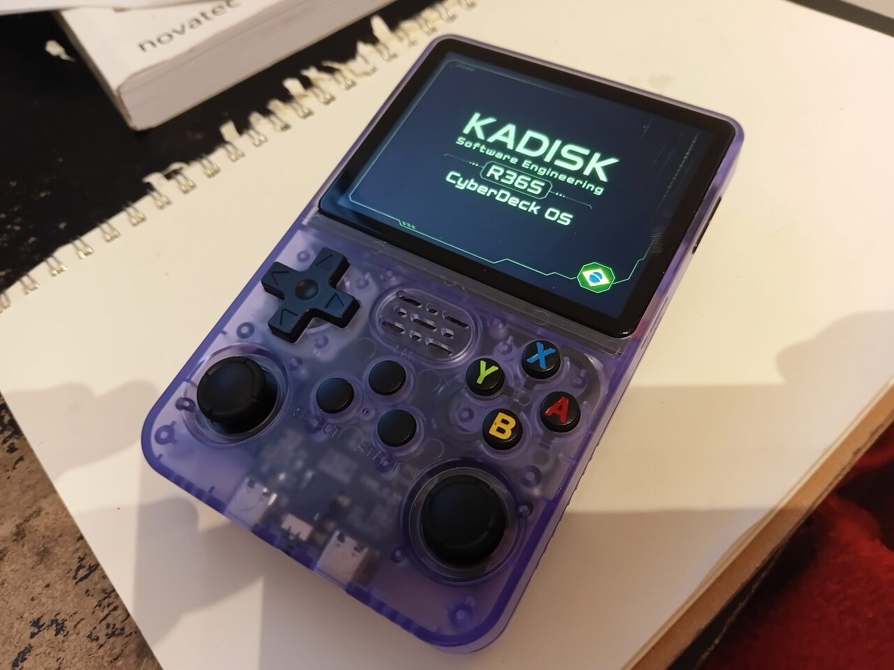
</p>

<p align="center"><sub>O <b>R36S físico</b> rodando o CyberDeck OS — da splash de boot à UI web navegável pelo gamepad.<br>Mais fotos do aparelho em <a href="#no-aparelho-real">No aparelho real</a> · capturas de tela na <a href="#galeria">Galeria</a>.</sub></p>

A história de como se chegou aqui — e **as outras tentativas/imagens que não deram
certo** — está em [`docs/JORNADA.md`](docs/JORNADA.md).

> 🛠️ **Tem um R36S e quer testar?** Pule direto para o [passo a passo de gravação](#testar-no-seu-r36s-passo-a-passo).

---

## O que é

- Uma distro Linux enxuta para o R36S, cuja cara é uma **UI web própria** (640×480).
- Um **CyberDeck**: status do sistema, rede, ferramentas, logs — não um console.
- A UI ([`cyberdeck-ui/`](cyberdeck-ui/)) é HTML/JS sem dependências, em modo kiosk.

## No aparelho real

Fotos do **R36S físico** (azul translúcido) rodando o CyberDeck OS — não é mockup nem
emulador: boota no aparelho, acende o painel e navega pelos botões.

| | |
|---|---|
| 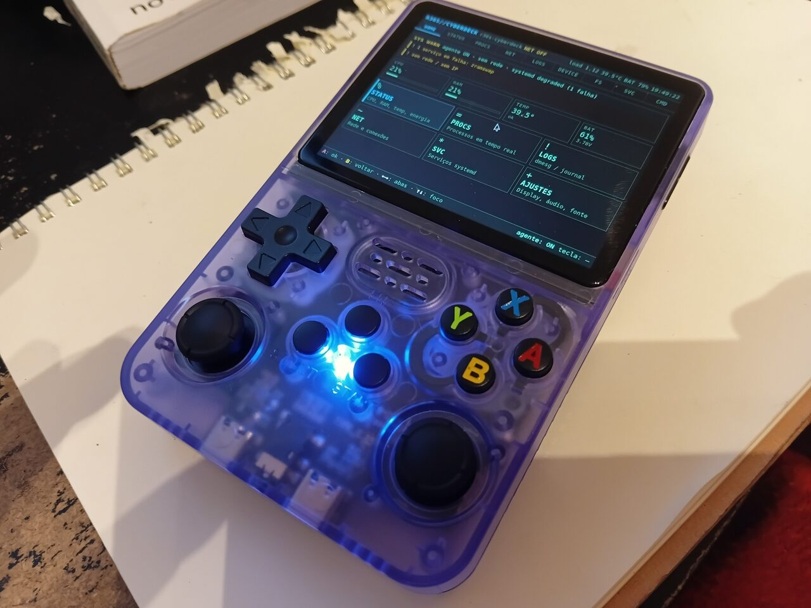 | 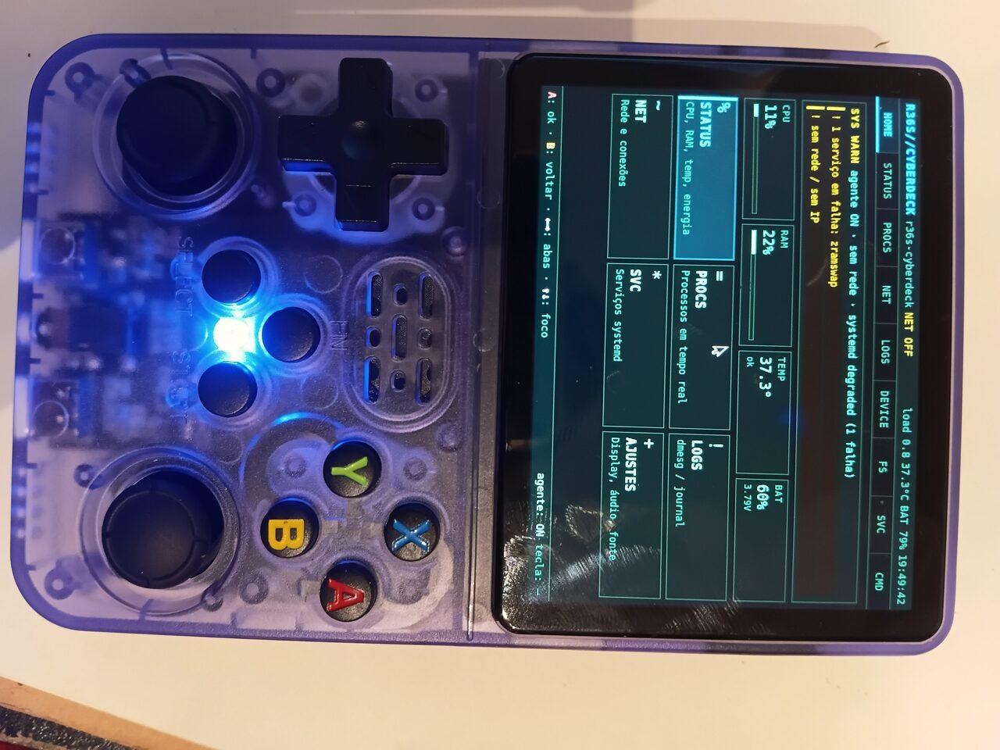 |
| **HOME na tela do R36S** — UI web em Chromium kiosk | **A mesma HOME**, tela legível de perto |
| 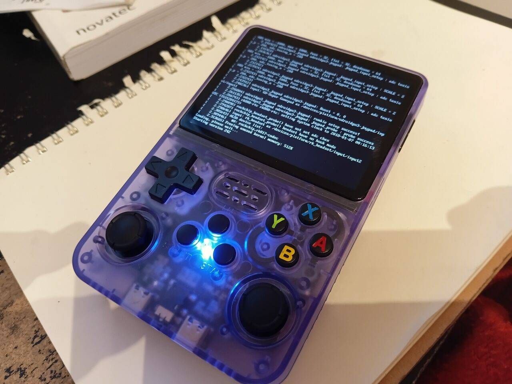 |  |
| **Boot** — kernel BSP 4.4 sobe e detecta o joypad | **Splash** — logo do projeto antes da UI |

## Galeria

Capturas de tela **reais do R36S físico** (640×480), tiradas no próprio aparelho (`L2+R2`).

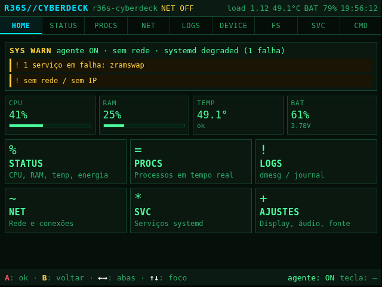

<sub>HOME (cockpit): faixa de alertas, *metric tiles* (CPU/RAM/TEMP/BAT) e cards das seções.</sub>


| | | |
|---|---|---|
| 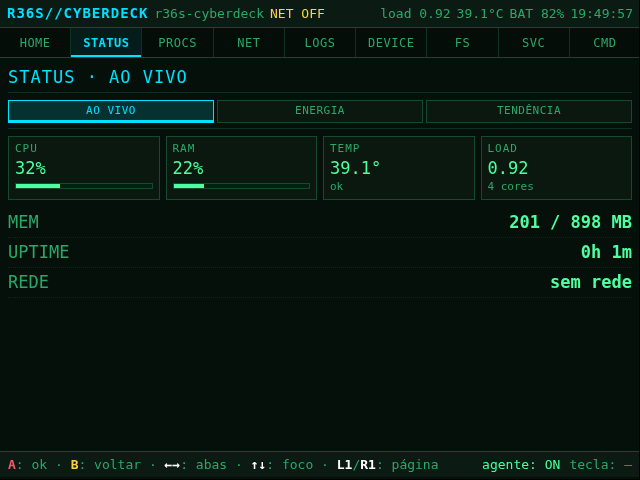 | 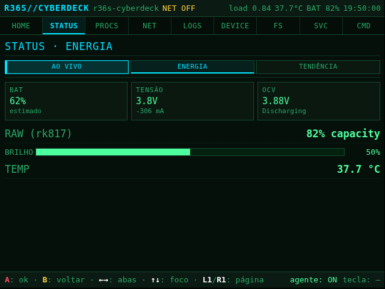 | 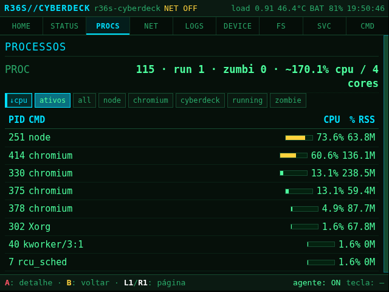 |
| **STATUS** — CPU/RAM/temp/load ao vivo | **STATUS · ENERGIA** — bateria por OCV (rk817) | **PROCS** — processos via `/proc` |
| 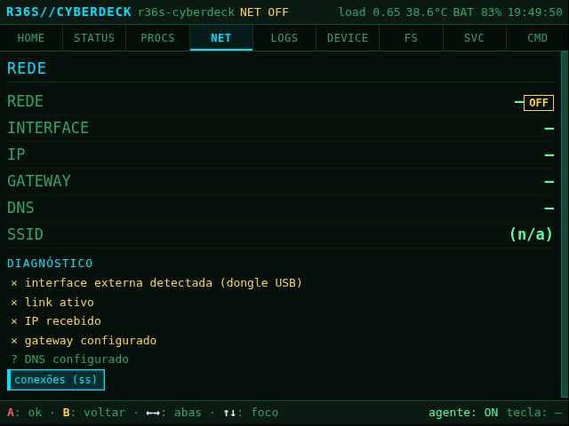 | 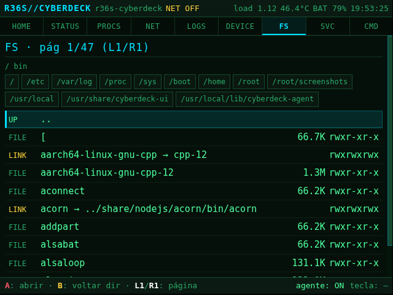 |  |
| **NET** — interfaces, rota, DNS, conexões | **FS** — navegação read-only do rootfs | **SVC** — systemd: status, logs, ações |
| 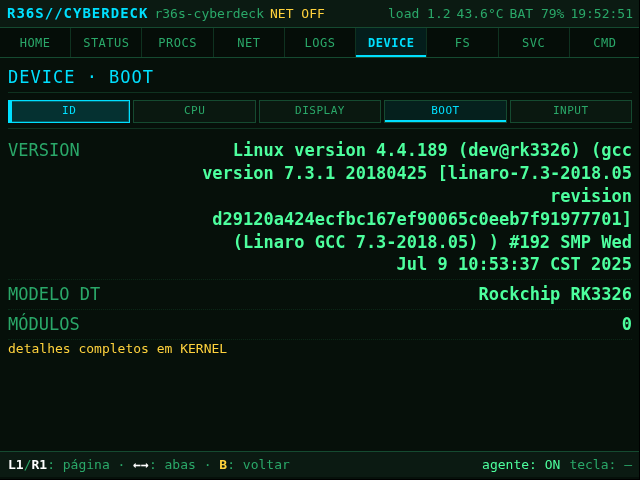 | 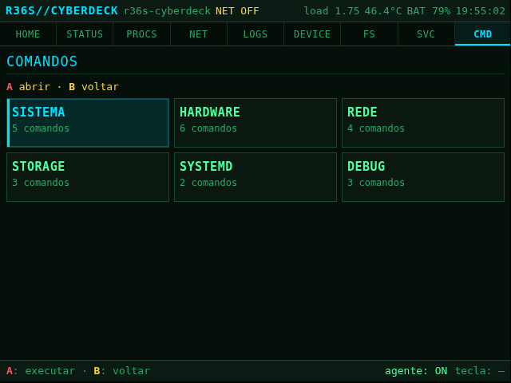 | 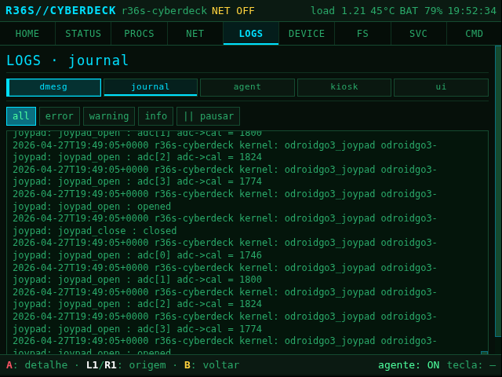 |
| **LOGS** — dmesg / journal / unidades | **CMD** — comandos por categoria (allowlist) | **DEVICE** — hardware, kernel, boot |

## Base e como ela foi montada

A versão que funciona combina **três decisões** descobertas na prática (ver
[`docs/JORNADA.md`](docs/JORNADA.md) para o porquê de cada uma):

| Camada | Escolha | Por quê |
|--------|---------|---------|
| **Boot** | Região de boot **clonada do ArkOS** (U-Boot + **kernel BSP 4.4** + `rk3326-r35s-linux.dtb`) | **Só o kernel+DTB BSP acende o painel** deste lote (mainline não sobe) |
| **Rootfs** | **Debian bookworm arm64** (debootstrap) | base limpa e atual, sem herdar o ArkOS |
| **Tela** | **Xorg** com driver **fbdev** em `/dev/fb0` (render por software) | evita Wayland/GBM do blob Mali (antigo demais) |
| **UI** | **Chromium `--kiosk`** abrindo `file://…/cyberdeck-ui` | navegador padrão, software rendering basta p/ UI leve |
| **Input** | **Gamepad API** do Chromium (joypad direto) | dispensa uinput/teclado virtual |
| **Dados** | **`cyberdeck-agent`** (backend **Node.js** modular, sem deps) servindo JSON de `/proc`+`/sys`+comandos allowlist | alimenta TODAS as abas (hardware, SO, FS, systemd, processos, rede, logs, ações) |

Pipeline de construção ([`scripts/build-x11-rootfs.sh`](scripts/build-x11-rootfs.sh)):

```
debootstrap Debian bookworm arm64 (2 estágios, qemu-aarch64-static)
  → instala xserver-xorg (fbdev) + chromium + zram + a cyberdeck-ui
  → compila e instala cyberdeck-agent (dados do sistema)
  → clona a região de boot do ArkOS (MBR + bootloader + FAT) byte-a-byte
  → escreve nosso boot.ini (root=UUID, console=tty1) + DTB do painel
  → empacota .img (ext4 por UUID) e registra a imagem como 'x11'
```

> ⚠️ O ArkOS é usado **somente como referência de boot/hardware** — a imagem é
> **somente leitura** e nunca é modificada. O rootfs final é Debian, não ArkOS.

---

## Hardware do R36S (resumo — ver [`docs/hardware/`](docs/hardware/))

| Componente | Detalhe |
|---|---|
| SoC | Rockchip **RK3326** · 4× Cortex-A35 (AArch64) |
| RAM | ~1 GB (zram ativo p/ alívio) |
| GPU | ARM **Mali-G31** (blob antigo — sem GL aberto utilizável) |
| Display | Painel MIPI-DSI **`elida,kd35t133`**, **640×480**, backlight PWM |
| PMIC / Áudio | **RK817** (power, bateria, carga) · `rk817-codec` |
| Input | **odroidgo3-joypad** (`/dev/input/event1`) |
| Kernel | Linux **4.4.189** (BSP Rockchip, do boot ArkOS) |

Sem Wi-Fi/Ethernet internos — rede só via **dongle USB**.

---

## Testar no seu R36S (passo a passo)

Tem um R36S e quer ver rodando? São **~30 min** (a maior parte é o build). Você precisa
de um **PC Linux**, um **microSD vazio de teste** (≥ 8 GB) e um leitor de cartão.

> ⚠️ **Use um microSD separado** — não o cartão do ArkOS. Confira a letra do device
> (`/dev/sdX`) antes de gravar: gravar no disco errado apaga dados.

**1. Pré-requisitos no PC** (Debian/Ubuntu):
```bash
sudo apt install -y debootstrap qemu-user-static binfmt-support \
                    gcc-aarch64-linux-gnu mtools
```

**2. Imagem de boot do ArkOS** (referência de hardware — usada **somente leitura**):
> Só o **kernel+DTB BSP do ArkOS acende o painel** deste R36S, então o build clona a
> região de boot de uma imagem ArkOS. Baixe o ArkOS do seu R36S e coloque o `.img` em
> `../Backups/ArkOS/` (irmão deste repo). O ArkOS **nunca é modificado**.

**3. Construir a imagem** (usa todos os cores; ~20–30 min):
```bash
sudo scripts/build-x11-rootfs.sh
# → gera artifacts/test-images/r36s-cyberdeck-x11.img
```

**4. Gravar no microSD.** Jeito mais simples (qualquer SO): abra a `.img` no
[**balenaEtcher**](https://etcher.balena.io/) e grave. Ou via `dd` no Linux:
```bash
lsblk                                    # ache o device do cartão (ex.: /dev/sdb)
sudo dd if=artifacts/test-images/r36s-cyberdeck-x11.img of=/dev/sdX \
        bs=4M conv=fsync status=progress
```
> Ou use o **kit seguro** do projeto (recusa disco do sistema, grava por nome):
> `sudo scripts/sdcard/sd-allow.sh /dev/sdX cartao-teste && sudo scripts/sdcard/sd-update.sh cartao-teste x11`

**5. Bootar.** Ponha o microSD no **slot do R36S** (o de baixo, não o do sistema) e
ligue. Você verá a **splash → HOME**. Navegue pelos botões (veja [Controles](#controles-navegação-pelo-gamepad)).

### Iteração rápida (sem regravar 4 GB)

```bash
sudo scripts/sdcard/sd-update-ui.sh <cartao>          # empurra só a UI (HTML/JS) p/ o cartão
sudo scripts/sdcard/sd-get-screenshots.sh <cartao>    # recupera os prints (/root/screenshots) p/ o host
```

Kit de SD completo em [`scripts/sdcard/`](scripts/sdcard/) (ver o README de lá): grava
por **nome do cartão** (descobre o `/dev/sdX` sozinho), recusa discos não-removíveis e
do sistema, e nunca toca no cartão do ArkOS.

---

## Controles (navegação pelo gamepad)

| Controle | Ação |
|---|---|
| **D-pad ↑↓←→** | navegação **espacial 2D** do foco (grid/listas); nas bordas horizontais, troca de aba |
| **A** | ativa o item **selecionado** (modo D-pad) ou clica no ponteiro (modo analógico) |
| **Start** | ativar o item focado |
| **B** / **Select** | voltar um nível |
| **Analógico esq.** | move o **ponteiro REAL do X** |
| **Analógico dir.** | **scroll** vertical |
| **L1 / R1** | trocar **subpágina/página** da seção (STATUS/DEVICE/AJUSTES, FS/SVC/PROCS, origem do LOG…) |
| **L2 + R2** (combo) | **screenshot** (salvo em `/root/screenshots/v<versão>/shot-NNNN.png`) |
| **FN** | abre o menu **FUNCTION** (Ajustes · Testar botões · Auto screenshot · Screenshot · recarregar/reiniciar/desligar) |
| **Volume + / −** | volume do sistema (via `amixer`) |

Atalhos de teclado (dev/USB): **+ / −** mudam o tamanho da fonte · **F12** ou
**PrintScreen** tiram screenshot · **AudioVolumeUp/Down/Mute** controlam o volume.
O tamanho da fonte também tem botões em **AJUSTES → DISPLAY** (persistido no agente).

> **Cor das referências de botão:** em toda a UI (rodapé, modal, menu FN, hints, teste de
> botões) os botões aparecem em **negrito** com cor fixa — **A** vermelho, **B** amarelo,
> **X** azul, **Y** verde; **L1/R1/L2/R2/FN/Start/Select** e as **setas** em branco.

> **Dois modos de input:** ao usar o **D-pad**, o ponteiro **some** e o **A ativa o item
> selecionado** (não depende do mouse); ao mexer no **analógico**, o ponteiro **reaparece**,
> faz *hover-select* e o A clica nele; sem uso por alguns segundos, o ponteiro some de novo.
>
> O **analógico esquerdo move o ponteiro de verdade do X** (não um cursor desenhado):
> isso é feito pelo driver `xserver-xorg-input-joystick` (`/etc/X11/xorg.conf.d/60-joystick.conf`),
> fora do navegador. O ponteiro do X fica **visível**. O clique do analógico não existe
> neste joypad, então **A clica** onde o ponteiro está. L1/R1 não trocam de aba.
>
> ⚠️ Índices de eixo/deadzone do `60-joystick.conf` podem precisar de ajuste no aparelho
> (use `evtest`/`xinput`) — **ainda não validado no R36S físico**.
>
> **Sensibilidade do ponteiro (suavidade):** o `60-joystick.conf` já vem com `deadzone`
> grande + `ConstantDeceleration` p/ um ponteiro lento e fácil de controlar. Para ajustar
> **ao vivo, sem reflashar** (via SSH/serial, com `DISPLAY=:0`):
> ```bash
> xinput --list                                   # achar o nome do joypad
> # maior = mais lento/suave:
> DISPLAY=:0 xinput --set-prop "<joypad>" "Device Accel Constant Deceleration" 4.0
> ```
> Para deixar permanente, mude `ConstantDeceleration` no `60-joystick.conf` (e/ou aumente
> `deadzone`) e rebuild/flash.

Padrão **mestre→detalhe** nas abas FS, SVC e PROCS: **A** abre o detalhe/arquivo,
**B** volta um nível (detalhe→lista, arquivo→diretório, subdir→pai). Ações perigosas
(restart/stop de serviço, kill de processo, reboot/poweroff) abrem uma **tela de
confirmação** — só executam com **A**; **B** cancela.

A tela **TESTE DE BOTÕES** (menu FN → "Testar botões") mostra todos os botões nomeados
acendendo ao pressionar + os analógicos; ela **captura todos os botões** (nenhuma
navegação dispara) e **sai com Start+Select juntos**.

## Abas da UI (alimentadas pelo `cyberdeck-agent`)

A tela inicial é a **HOME** (cockpit): faixa de **alertas**, **metric tiles** (CPU/RAM/
TEMP/BAT) e **cards** das seções. A barra de abas no topo dá acesso direto a cada seção;
funções e energia ficam no **menu FN**.

| Aba | Mostra |
|---|---|
| **HOME** | painel inicial com cards de todas as seções + resumo (host, uptime, cores) |
| **STATUS** | CPU, RAM, brilho, load, uptime, temp, bateria — ao vivo (2 s). Bateria: % bruto do rk817 **+ estimativa por OCV** (tabela 1S LiPo, compensada por I·R) — o `capacity` do rk817 é instável e é marcado quando duvidoso |
| **DEVICE** | identidade, hardware (freq/core, temps, mem/zram), kernel/boot, tela/backlight, input (joypad/USB) |
| **FS** | navegação **read-only** do rootfs: lista, permissões, tamanho, symlinks; viewer de texto; atalhos |
| **SVC** | systemd: resumo + lista filtrável → detalhe (status, unit file, logs) + ações (start/stop/restart) |
| **PROCS** | processos via `/proc`: resumo, ordenação/filtro, → detalhe por PID + sinais (SIGTERM/SIGKILL) |
| **NET** | interfaces (estado, IPs, MAC, RX/TX), gateway, DNS, SSID/sinal, conexões (`ss`) |
| **LOGS** | dmesg / journal / unidades (agent, kiosk, ui) com filtro de severidade, busca e pausa |
| **CMD** | comandos prontos por categoria (**allowlist**); saída em tela cheia, B volta |
| **AJUSTES** | subabas **DISPLAY** (fonte ±, brilho ±, screenshot) e **AUDIO** (barra de volume, Volume ±/mudo, **testar alto-falante** e **testar fone**) — acessível pelo menu FN |
| **KERNEL** | kernel detalhado (version, cmdline, taint, módulos carregados) + **Device Tree** (modelo, compatible, bootargs, nós) — card na HOME |
| **TESTE DE BOTÕES** | painel de todos os botões nomeados que acendem ao pressionar + analógicos — acessível pelo menu **FN**; sai com Start+Select |

O menu **FN** (botão Function) concentra: **Ajustes**, **Testar botões**, **Auto
screenshot** (captura a cada troca de tela), **Screenshot agora**, e **ENERGIA**
(recarregar UI, reiniciar agente/kiosk, reiniciar/desligar — com confirmação).

### Endpoints do agente (`127.0.0.1:8080`, JSON `{ok,data}` / `{ok,error}`)

```
GET  /api/status                 GET  /api/fs/list?path=     GET  /api/processes
GET  /api/device                 GET  /api/fs/read?path=     GET  /api/processes/:pid
GET  /api/network/summary        GET  /api/fs/bookmarks      POST /api/processes/:pid/signal {signal}
GET  /api/network/connections    GET  /api/systemd/summary   GET  /api/logs?source=&severity=&q=
GET  /api/systemd/services       GET  /api/systemd/service?unit=   GET /api/logs/sources
GET  /api/systemd/logs?unit=     POST /api/systemd/action {action,unit}
GET  /api/commands               POST /api/commands/exec {key}
GET  /api/actions                POST /api/actions {key}    (bright±, volume±/mute, audio-test-spk/hp, reload/restart/reboot/poweroff)
GET  /api/kernel                 GET/POST /api/settings {fontScale}
GET  /api/volume                 GET  /api/health           GET /api/ping (versão do agente)
GET  /api/device                 POST /api/screenshot {version} -> /root/screenshots/v<versão>/shot-NNNN.png
```

**Modelo de segurança:** o agente roda em `127.0.0.1` e **não expõe execução de shell
arbitrária**. Comandos (`CMD`) e ações (`AJUSTES`, `SVC`) são **allowlist** validadas no
backend; tudo via `execFile` (sem shell). FS é **read-only** com path saneado (sem
`../` para fora da raiz), limites de tamanho/entradas e detecção de binário. Nomes de
unit e sinais são validados por regex/allowlist. Detalhes em [`docs/STACK.md`](docs/STACK.md).

### Validação local (host)

```bash
find cyberdeck-agent -name '*.js' -exec node --check {} \;   # sintaxe do backend
node cyberdeck-agent/agent.js 8080 &                          # sobe o agente
( cd cyberdeck-ui/public && python3 -m http.server 8090 )     # serve a UI
# abra http://localhost:8090  (640x480) — ou index.html#procs p/ ir direto numa aba
```

> Sem o agente, a UI mostra **agente: OFF** no rodapé e uma tela de erro amigável por
> aba (não trava). `dmesg`/journal completos dependem de rodar como root (no R36S o
> `cyberdeck-agent` roda como root via systemd).

---

## Estrutura do repositório

```
cyberdeck-ui/    UI web (HTML/CSS/JS, public/js/*) — a cara do CyberDeck (HOME + abas)
cyberdeck-agent/ backend Node.js modular (agent.js + lib/*.js) — JSON de hw/SO/FS/systemd/procs/rede/logs
cyberdeck-fb/    UI nativa alternativa (renderizador 2D em C no framebuffer)
scripts/         build-x11-rootfs.sh + inspeção do ArkOS + kit de SD (sdcard/)
runtime/         serviços systemd + scripts de inicialização (Xorg/kiosk/agent)
board/r36s/      arquivos da placa (boot.ini, overlays)
artifacts/       artefatos de referência extraídos do ArkOS (boot/DTB)
docs/            documentação + JORNADA.md (como chegamos aqui, becos sem saída)
experiments/     tentativas que NÃO entraram (Wayland/Mali, mainline, uinput)
```

Histórico em [`CHANGELOG.md`](CHANGELOG.md); jornada completa e tentativas em
[`docs/JORNADA.md`](docs/JORNADA.md). **Arquitetura e stack** (Linux + Node.js +
front-end) como referência reaproveitável em [`docs/STACK.md`](docs/STACK.md).
