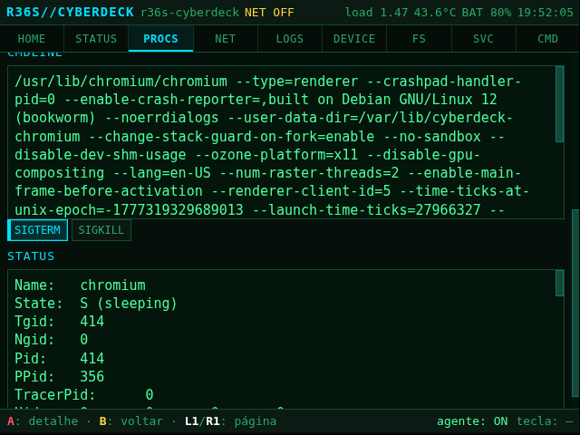

# Arquitetura da UI — CyberDeck

## Objetivo

UI única, fullscreen, **640×480**, navegável só por botões do R36S. Visual de
"cyberdeck/terminal", leve, sem frameworks pesados na v1.


<sub>HOME (cockpit) no R36S físico — faixa de alertas, *metric tiles* e cards das
seções. Mais telas na [Galeria do README](../../README.md#galeria).</sub>

## Camadas

```
┌──────────────────────────────────────────┐
│  Apresentação (HTML/CSS)                   │
│  - layout 640x480, tema escuro/monoespaço  │
│  - foco visível, 1 ação primária por tela  │
├──────────────────────────────────────────┤
│  Lógica (JS vanilla na v1)                 │
│  - roteamento entre seções                 │
│  - navegação por D-pad/A/B/L1/R1           │
│  - polling de dados do sistema             │
├──────────────────────────────────────────┤
│  Ponte de dados                            │
│  - JSON/WebSocket de um agente local       │
│  - terminal via pty/WebSocket              │
├──────────────────────────────────────────┤
│  Sistema                                   │
│  - /proc, /sys, ip, /sys/class/power_supply│
│  - rk817 (bateria), backlight              │
└──────────────────────────────────────────┘
```

## Seções planejadas

| Seção | Fonte de dados |
|-------|----------------|
| **Terminal** | pty via WebSocket (`ttyd`/xterm.js) |
| **CPU/RAM** | `/proc/stat`, `/proc/meminfo`, `/proc/loadavg` |
| **Rede** | `ip addr`, `/sys/class/net/*` (dongle USB) |
| **Bateria** | `/sys/class/power_supply/*` (RK817) |
| **Relógio** | hora do sistema |
| **Logs** | `journalctl`/`dmesg` (leitura) |
| **Comandos rápidos** | scripts em `runtime/scripts` / `board` |
| **Ferramentas locais** | utilitários da distro |
| **Dispositivo** | modelo, SoC, serial, DTB, versão da distro |

## Navegação por botões

| Botão | Ação na UI |
|-------|-----------|
| D-pad | mover foco |
| A | confirmar / abrir |
| B | voltar / cancelar |
| L1 / R1 | aba anterior / próxima |
| Start | menu principal |
| Select | ação secundária / ajuda |

Implementação: ouvir **Gamepad API** quando disponível; senão, um agente lê
`/dev/input/js0` e injeta `keydown` (setas/Enter/Esc). Ver
[`../hardware/input-buttons.md`](../hardware/input-buttons.md).

Exemplo do padrão **mestre→detalhe** (lista → item com ações), aqui em PROCS:



## Evolução

- **v1:** HTML/CSS/JS vanilla, sem build, sem dependências pesadas.
- **v2+:** se necessário, um bundler leve; manter compatível com WPE WebKit.
- Sempre testar a navegação **só com botões** (sem mouse).
